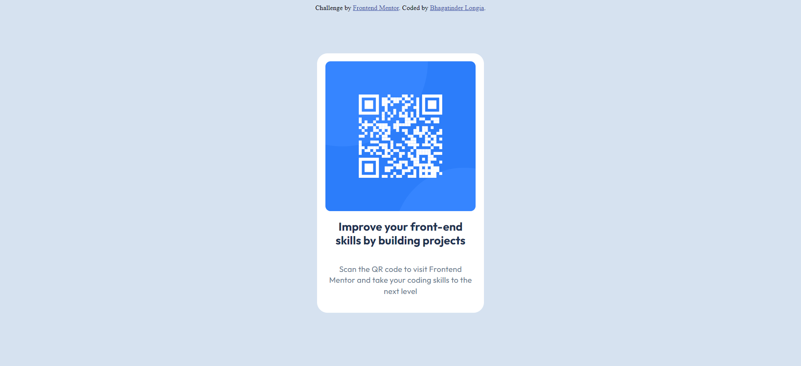

# Frontend Mentor - QR code component solution

This is a solution to the [QR code component challenge on Frontend Mentor](https://www.frontendmentor.io/challenges/qr-code-component-iux_sIO_H). Frontend Mentor challenges help you improve your coding skills by building realistic projects. 

## Table of contents

- [Overview](#overview)
  - [Screenshot](#screenshot)
  - [Links](#links)
- [My process](#my-process)
  - [Built with](#built-with)
  - [What I learned](#what-i-learned)
  - [Continued development](#continued-development)
  - [Useful resources](#useful-resources)
- [Author](#author)

## Overview

### Screenshot



### Links

- [Github repository link](https://github.com/Bhagat-Longia/QR-code-component)
- [Live site URL](https://bhagat-longia.github.io/QR-code-component/)

## My process

### Built with

- Semantic HTML5 markup
- CSS custom properties
- Flexbox
- CSS Grid
- Mobile-first workflow

### What I learned:

  - Importing google fonts into your website
  - Working with different types of CSS selectors
  - Centering elements on a page using CSS position and transform properties
  - Working with flexbox to make elements responsive on all screen sizes

```css
.proud-of-this-css {
  /* Centering the card to the center of the page */
    position: absolute;
    left: 50%;
    top: 50%;
    transform: translate(-50%, -50%);

    /* Centering the elements of the card to the 
    center of the page */
    display: flex;
    flex-direction: column;
    justify-content: center;
    align-items: center;
    text-align: center;
}
```

### Continued development

In future, I might add javascript to this website to allow users to create their own dynamic QR codes by using the website.


### Useful resources

- [Flexbox properties codepen](https://codepen.io/enxaneta/full/adLPwv/) - This is an amazing code pen which helped me to play around and understand different flexbox properties by visualizing their effect on some div containers.

## Author

- Frontend Mentor - [@Bhagat-Longia](https://www.frontendmentor.io/profile/Bhagat-Longia)
- LinkedIn - [Bhagatinder Longia](https://www.linkedin.com/in/bhagatinder-singh/)
